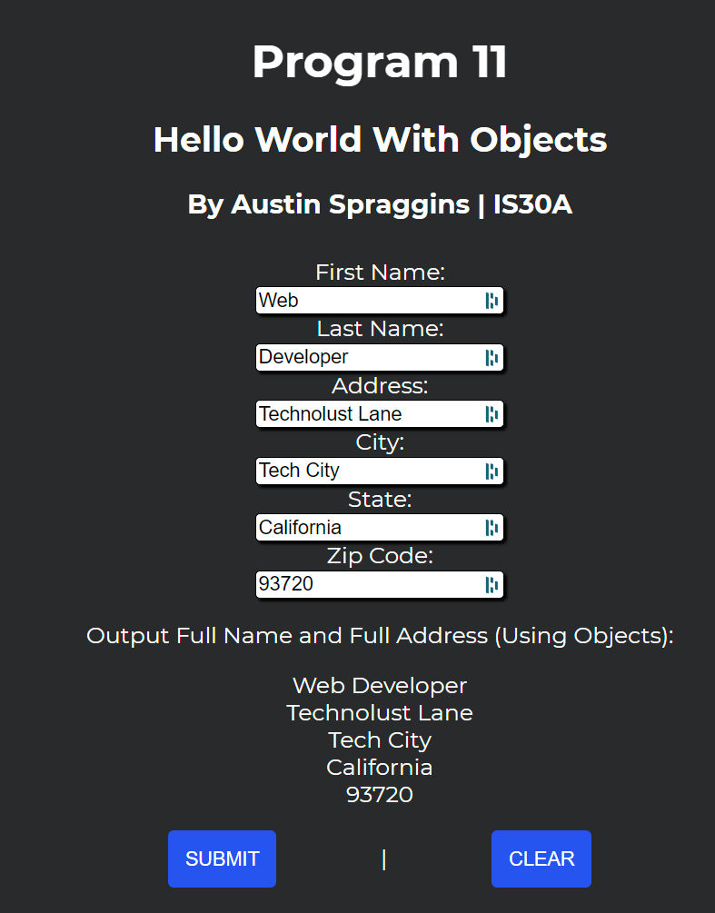

# Program 11
JavaScript Objects Coding Challenge 

## Instructions

Create a webpage where the user will enter their first name, last name, address, city, state, and zip code. After the user enters their information into the input fields, using object properties in JavaScript, the user will have their full name and address displayed to them, with the option to clear the form and results. 

## Conclusion

I wrote this during my time in a class IS30A. It was one of my final classes before achieving my Associate Degree in Web Design. I completed the class several weeks early as this is very beginner JavaScript. Still, I wanted to make it public as this is my work. 

